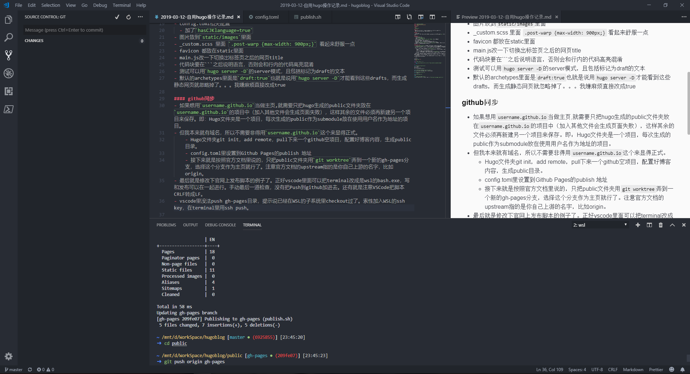

#### 安装
- 在WSL上使用，github上有编译的extended的deb版本 因为要使用scss自定义格式
- 官方教程安装 初始化目录，下载主题，新建项目等等

#### 主题
- 用LeaveIt主题
- github上下下来主题后，并没有按照官方加成submodule，直接把主题的`.git`删了，不再单独处理

#### 自定义
- config.toml相关配置
  - 加了`hasCJKlanguage=true`
- 图片放到`static/images`里面，先同步再引用github的地址
- _custom.scss 里面 `.post-warp {max-width: 900px;}` 看起来舒服一点
- favicon 都放在static里面
- main.js改一下切换出标签页之后的网页title
- 代码块要在```之后说明语言，否则会和行内的代码高亮混淆
- 测试可以用`hugo server -D`的server模式，且包括标记为draft的文本
- 默认的archetypes里面是`draft:true`也就是说用`hugo server -D`才能看到这些drafts，而生成静态网页就忽略掉了。。。嫌麻烦直接改成true

#### github同步
- 如果想用`username.github.io`当做主页,就需要只把hugo生成的public文件夹放在`username.github.io`的项目中（加入其他文件会生成页面失败），这样其余的文件必须再新建另一个项目来保存。即：Hugo文件夹是一个项目，每次生成的public作为submodule放在使用用户名作为地址的项目。
- 但我本来就有域名，所以不需要非得用`username.github.io`这个
    - Hugo文件夹git init，add remote，pull下来一个github空项目，配置好博客内容，生成public目录。
    - config.toml里设置到Github Pages的publish 地址
    - 接下来就是按照官方文档里说的，只把public文件夹用`git worktree`弄到一个新的gh-pages分支，选择这个分支作为主页就行了。注意官方文档的upstream指的是你自己上游的名字，比如origin。
- 最后就是修改下官网上发布脚本的例子了。正好vscode里面可以把terminal改成是wsl的bash.exe，写和发布可以在一起进行。手动最后一道检查，没有把Push到github加进去。还有就是注意VSCode把脚本CRLF转成LF。
- vscode里没法push gh-pages目录，提示说已经在WSL的子系统里checkout过了。索性加入WSL的ssh key，在terminal里用ssh push。

```shell
#!/bin/sh
DIR=$(dirname "$0")
cd $DIR/..

if [[ $(git status -s) ]]
then
    echo "The working directory is dirty. Please commit any pending changes."
    exit 1;
fi

echo "Deleting old publication"
rm -rf public
mkdir public
git worktree prune
rm -rf .git/worktrees/public/

echo "Checking out gh-pages branch into public"
git worktree add -B gh-pages public origin/gh-pages

echo "Removing existing files"
rm -rf public/*

echo "Generating site"
hugo

echo "Updating gh-pages branch"
cd public && git add --all && git commit -m "Publishing to gh-pages (publish.sh)"
```
#### VSCode一站式解决
